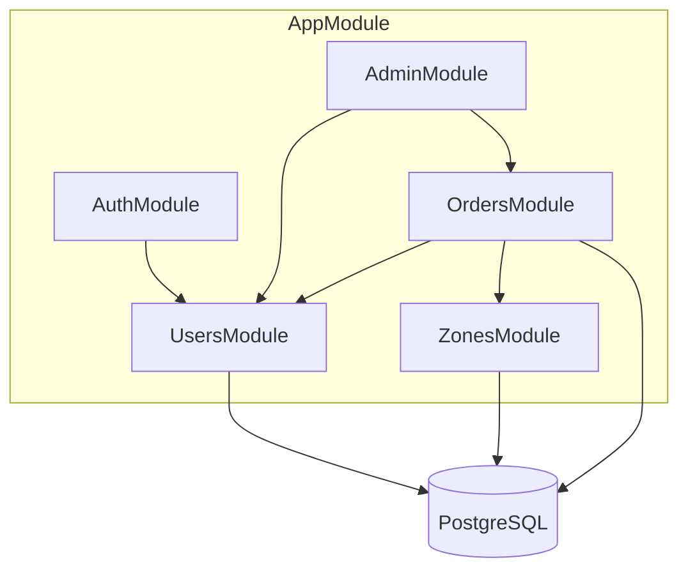
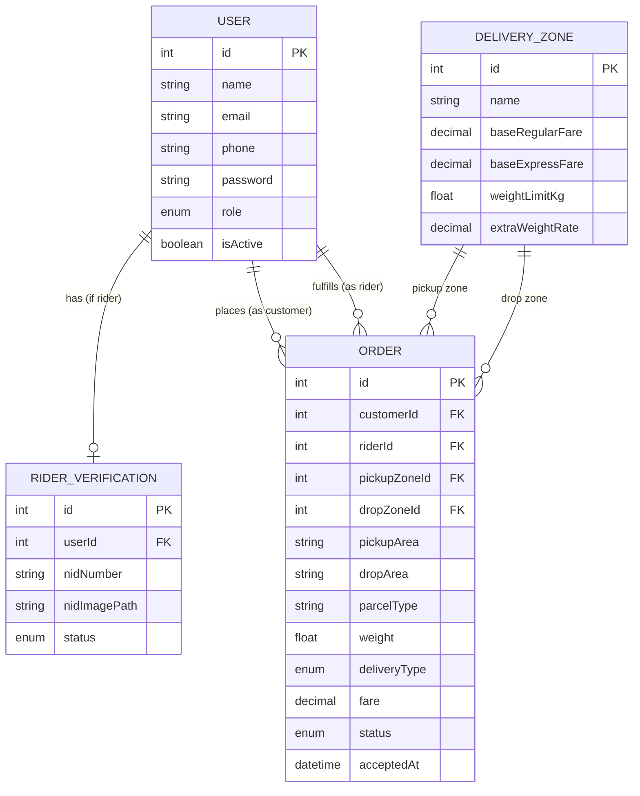
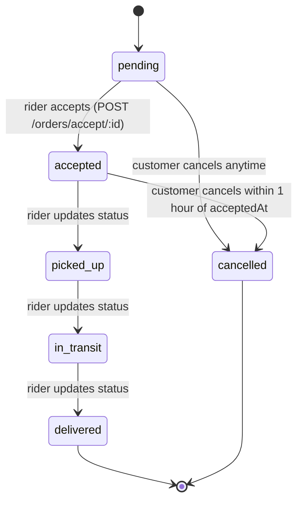

# System Design Document
## Parcel Delivery Platform (NestJS Backend)

**Version:** 1.0
**Team size:** 4 members
**Stack:** NestJS, TypeORM, PostgreSQL (or MySQL), JWT, Multer, class-validator

---

## 1. Overview

The system is a backend API for a courier/parcel delivery service operating across
delivery zones (initially **Inside Dhaka** and **Outside Dhaka**). It supports three
user roles:

- **Customer** — creates and tracks delivery orders
- **Rider** — browses, accepts, and fulfills orders (must be NID-verified)
- **Admin** — verifies riders, manages zone pricing, suspends users, views stats

The goal of this sprint is a working REST API with authentication, order lifecycle
management, zone-based fare calculation, and an admin control layer.

---

## 2. Tech Stack

| Layer | Choice |
|---|---|
| Framework | NestJS |
| ORM | TypeORM |
| Database | PostgreSQL (MySQL works too — no Postgres-only types are required) |
| Auth | JWT (`@nestjs/jwt`, `passport-jwt`) |
| Validation | `class-validator` + `class-transformer`, global `ValidationPipe` |
| File uploads | Multer, local disk storage (`./uploads`) |
| Password hashing | `bcrypt` |
| Config | `@nestjs/config` (`.env` for DB creds, JWT secret) |

---

## 3. High-Level Architecture

Standard NestJS layered architecture: **Controller → Service → Repository (TypeORM
entity) → Database.** Each domain is its own module, all wired together in `AppModule`.



`AuthModule`, `OrdersModule`, and `AdminModule` all depend on `UsersModule` (for the
`User` entity/repository). `OrdersModule` additionally depends on `ZonesModule` for
fare lookups. This dependency shape drives the recommended build order in §13.

---

## 4. User Roles & Permissions

| Action | Customer | Rider (verified) | Admin |
|---|:---:|:---:|:---:|
| Register / Login | ✅ | ✅ | — (seeded) |
| Create / edit / cancel own orders | ✅ | ❌ | ❌ |
| Browse available orders, accept, update status | ❌ | ✅ | ❌ |
| View / edit own profile | ✅ | ✅ | ✅ |
| View zone rates | ✅ | ✅ | ✅ |
| Create / update zone rates | ❌ | ❌ | ✅ |
| Verify or reject rider NID | ❌ | ❌ | ✅ |
| Suspend users | ❌ | ❌ | ✅ |
| View dashboard stats | ❌ | ❌ | ✅ |

**Design note:** a rider account existing is not the same as a rider being
*verified*. Recommend gating the rider-only order endpoints (`/orders/available`,
`/orders/accept/:id`, `/orders/status/:id`) on `RiderVerification.status === 'approved'`,
not just `role === 'rider'` — otherwise an unverified rider could accept deliveries.
This can be a small custom guard or a check inside `orders.service.ts`.

---

## 5. Database Design

### 5.1 Entities

**`User`**
`id, name, email (unique), phone (unique), password (hashed), role: enum('customer','rider','admin'), isActive: boolean, createdAt, updatedAt`

**`RiderVerification`** (1-to-1 with `User`, riders only)
`id, userId (FK), nidNumber, nidImagePath, status: enum('pending','approved','rejected'), createdAt, updatedAt`

**`Order`**
`id, customerId (FK → User), riderId (FK → User, nullable), pickupZoneId (FK → DeliveryZone), pickupArea, dropZoneId (FK → DeliveryZone), dropArea, parcelType, weight, deliveryType: enum('regular','express'), fare: decimal, status: enum('pending','accepted','picked_up','in_transit','delivered','cancelled'), acceptedAt (nullable), createdAt, updatedAt`

**`DeliveryZone`**
`id, name, baseRegularFare: decimal, baseExpressFare: decimal, weightLimitKg: float, extraWeightRate: decimal, createdAt, updatedAt`

### 5.2 Entity-Relationship Diagram



---

## 6. Order Lifecycle (State Machine)



Business rules encoded here:
- A customer can cancel a `pending` order at any time.
- A customer can cancel an `accepted` order only within 1 hour of `acceptedAt` — after
  that, cancellation should be blocked (or routed to a support/admin flow, which is
  currently out of scope).
- Only the `riderId` assigned to an order may transition it through
  `picked_up → in_transit → delivered`.
- Editing (`PATCH /orders/customer/edit/:id`) should only be allowed while status is
  `pending`, since an accepted order is already committed to a rider.

---

## 7. Fare Calculation Logic

Computed in `orders.service.ts` at order creation time, using the `DeliveryZone`
matching `pickup_zone` (or a documented convention if pickup/drop zones differ):

```
baseFare = deliveryType === 'express' ? zone.baseExpressFare : zone.baseRegularFare
extraWeight = max(0, weight - zone.weightLimitKg)
fare = baseFare + (extraWeight * zone.extraWeightRate)
```

Two default zones are seeded on startup: **Inside Dhaka** and **Outside Dhaka**, each
with its own regular/express base fare, free weight allowance, and per-kg overage rate.

---

## 8. Authentication & Authorization

- **Registration:** separate endpoints for customer vs. rider (`register-customer`,
  `register-rider`) since riders submit an NID number + image; passwords are hashed
  with bcrypt before storage.
- **Login:** accepts email or phone + password, returns a signed JWT containing
  `{ sub: userId, role }`.
- **`JwtAuthGuard`:** validates the token via `jwt.strategy.ts`, rejects requests with
  missing/invalid/expired tokens.
- **`RolesGuard` + `@Roles()` decorator:** reads required roles from route metadata and
  compares against the authenticated user's `role`. Applied as
  `@UseGuards(JwtAuthGuard, RolesGuard)`.
- **File uploads:** NID images handled via Multer disk storage into `./uploads`;
  validate MIME type (jpg/png/pdf) and a max file size at the interceptor level.

---

## 9. API Endpoint Summary

### Auth (`/auth`) — public
| Method | Path | Notes |
|---|---|---|
| POST | `/auth/register-customer` | JSON body |
| POST | `/auth/register-rider` | multipart (NID file) |
| POST | `/auth/login` | returns JWT |

### Users (`/users`) — authenticated, any role
| Method | Path | Notes |
|---|---|---|
| GET | `/users/profile` | own profile |
| PATCH | `/users/profile` | edit name/phone/password |

### Orders — customer (`/orders`)
| Method | Path | Role |
|---|---|---|
| POST | `/orders/create` | customer |
| PATCH | `/orders/customer/edit/:id` | customer, pending only |
| DELETE | `/orders/customer/cancel/:id` | customer, per cancellation rules |
| GET | `/orders/customer/history` | customer |

### Orders — rider (`/orders`)
| Method | Path | Role |
|---|---|---|
| GET | `/orders/available` | rider (verified), supports zone query params |
| PATCH | `/orders/accept/:id` | rider (verified) |
| PATCH | `/orders/status/:id` | rider, must own the order |

### Zones (`/zones`)
| Method | Path | Role |
|---|---|---|
| GET | `/zones` | public / any authenticated user |
| POST | `/zones` | admin |
| PATCH | `/zones/:id` | admin |

### Admin (`/admin`)
| Method | Path | Role |
|---|---|---|
| GET | `/admin/dashboard` | admin |
| PATCH | `/admin/verify-rider/:id` | admin |
| PATCH | `/admin/users/suspend/:id` | admin |

---

## 10. Validation & Error Handling

- Global `ValidationPipe({ whitelist: true, forbidNonWhitelisted: true })` in `main.ts`
  strips/rejects unexpected fields on every DTO-validated route.
- Each DTO uses `class-validator` decorators (`@IsEmail`, `@IsEnum`, `@MinLength`, etc.)
  matching the descriptions in the original file list.
- Use NestJS's built-in `HttpException` subclasses (`BadRequestException`,
  `ForbiddenException`, `NotFoundException`) for consistent error shapes; consider one
  shared exception filter if custom error formatting is wanted later.

---

## 11. Team Ownership Matrix

| Member | Primary modules | Also touches |
|---|---|---|
| 1 — Architect | `auth/`, base entities (`User`, `RiderVerification`) | — |
| 2 — Customer Lead | `orders/` (customer half: entity, create/update DTOs, customer service+controller logic) | depends on Member 4's `DeliveryZone` for fare calc |
| 3 — Rider Lead | `orders/` (rider half: filter/status DTOs, rider service+controller logic) | shares `orders.service.ts` / `orders.controller.ts` with Member 2 |
| 4 — Admin Lead | `zones/` (full module), `admin/` (full module) | finishes `users/` service+controller (profile, admin seeding) |

---

## 12. Risks & Mitigations

**Shared-file conflicts:** `orders.service.ts` and `orders.controller.ts` are each
edited by two people (Members 2 and 3) simultaneously. Recommend:
- Agree on clear section markers (`// ---- CUSTOMER LOGIC ----` / `// ---- RIDER LOGIC ----`)
  before either starts, so diffs stay localized.
- Small, frequent commits and pulls rather than one large end-of-sprint merge.
- Alternatively, split into `orders.customer.service.ts` / `orders.rider.service.ts`
  (both injected into a single controller or split into two controllers under the
  same module) to eliminate the conflict entirely — worth a quick team decision before
  work starts.

**Cross-module dependency:** Member 2's fare calculation needs Member 4's
`DeliveryZone` entity and seed data to exist first. Member 4 should prioritize the
`zones/` entity + seeding early, even before the rest of the admin module.

**Rider-gate gap:** as noted in §4, verify that "verified rider" (not just "role =
rider") is what actually gates order-acceptance endpoints.

---

## 13. Suggested Build Order

1. **Member 1** sets up DB connection, `User` + `RiderVerification` entities, and
   `AppModule` wiring first — everyone else depends on `User`.
2. **In parallel once entities exist:** Member 1 finishes auth; Member 4 builds
   `zones/` (entity + seeding + CRUD) since Member 2 needs it.
3. **Members 2 & 3** build out `orders/` once `User` and `DeliveryZone` exist.
4. **Member 4** finishes `admin/` last, since dashboard stats read from both `User`
   and `Order`.
5. Integration pass: wire all modules into `AppModule`, run end-to-end manual tests
   through the full order lifecycle (register → login → create order → accept →
   deliver) plus the admin flows (verify rider, suspend user, view dashboard).

---

## 14. Out of Scope (This Sprint)

- Payments / online payment integration
- Real-time order tracking (WebSockets/GPS)
- Push/SMS/email notifications
- Rider ratings & reviews
- Multi-language support
